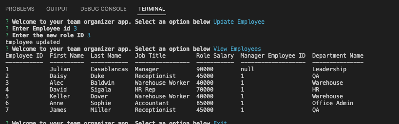

# SQL Employee Tracker  

## Description
This Command-Line tool uses SQL commands to create and manage a database of employees.

## Screenshots

## Table of Contents:
* [Installation](#installation)
* [Usage](#usage)
* [License](#license)
* [Contributing](#contributing)
* [Tests](#tests)
* [Questions](#questions)
### Installation:
This project uses the following dependencies:
```Navigate to directory and use npm i to install dependencies then run node app.js```
### Usage:
Use as needed
### License:
This project is licensed under:
MIT License
### Contributing:
Contribute as needed
### Tests:
In order to test open the console and run the following:
```N/A```
### Questions:
If you have any questions contact me on [GitHub](https://github.com/adam42288) or email 
me at A75052@gmail.com  
 